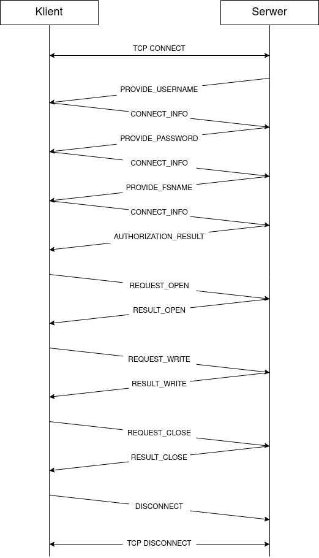

# TIN - NFS - Dokumentacja końcowa

## Skład zespołu
* Świrta Bartosz - lider
* Wojno Maciej
* Woźniak Szymon 
* Hebda Jakub 

Data przekazania dokumentacji wstępnej: --.--.----

## Temat projektu
<p align="justify">
Napisać program obsługujący uproszczoną wersję protokołu NFS (Network File System). Należy zaimplementować: serwer, bibliotekę kliencką (jako plik .a lub .so) oraz testowe programy klienckie realizujące funkcje operujące na zdalnych plikach (zlokalizowanych na serwerze sieciowym). Biblioteka kliencka ma udostępniać zdalne odpowiedniki niektórych funkcji systemowych na plikach (open, close, read, write, lseek, unlink, fstat, flock).
</p>

### Wariant zadania
* zaimplementować blokowanie dostepu do plików w trybie *jeden pisarz albo wielu czytelników* - zob. [flock(2)](https://man7.org/linux/man-pages/man2/flock.2.html)
* zaimplementować po stronie serwera możliwość udostępniania wielu niezależnych systemów plików

## Interpretacja treści i przyjęte założenia
<p align="justify">
Proponowane rozwiązanie to protokół stanowy, w którym udostępnianie zdalnego systemu plików użytkownikowi zostanie wykonane w ramach zestawionej sesji. Udostępniane przez serwer systemy plików są na serwerze oddzielnymi katalogami. Wszytskie operacje plikowe będą wykonywane przez system operacyjny Linux - wykorzystamy gotowe systemy plików. W konsekwencji planujemy nałożyć minimalną logikę na implementowane funkcje plikowe i w większości wypadków wysyłać w odpowiedzi bezpośrodnio zwrócone przez nie wartości.  
Przyjmujemy następujące założenia:  

- Komunikacja między klientem a serwerem odbywa się z wykorzystaniem protokołu TCP
- Klient łącząc się z serwerem uzyskuje dostęp do wybranego systemu plików
- Klient w ramach utworzonego połączenia może wykonywać operacje plikowe
- Klient może zestawić wiele niezależnych połaczeń z serwerem
- Serwer wykonuje operacje na plikach wykorzystując funkcje systemowe
- Serwer autoryzuje użytkownika za pomocą mechanizmu użytkowników systemowych
- Implementacja nakłada ograniczenie na maksymalny rozmiar pliku wynikający z możliwość zaalokowania bufora o maksymalnym rozmiarze int64. W praktyce jest to ~8EB co jest połową teoretycznego maksymalnego rozmiaru pliku na maszynie 64bit.
</p>

## Opis funkcjonalny
### Ujęcie ogólne  
Klientowi zostają udostępnione poniższe funkcjonalności:
- możliwość połączenia się ze zdalnym systemem plików
- dokonywanie standardowych operacji plikowych:
    - odczyt pliku
    - zapis pliku
    - edycja pliku
    - usunięcie pliku  

__Biblioteka kliencka__  
<p align="justify">
Biblioteka udostępnia programiście klasę NFSConnection, do stworzenia której programista musi podać nazwę użytkownika i hasło na systemie serwera oraz nazwę wybranego systemu plików udostępnianego przez serwer. Obiekt tej klasy enkapsuluje w swojej implementacji nawiązanie połączenia z serwerem, autoryzację użytkownika oraz wybranie systemu plików, i udostępnia następujące metody:
</p>

- `ConnectReturn connect(const std::string &hostName,
                         const std::string &username,
                         const std::string &password,
                         const std::string &filesystemName)`
- `int open(char *path, int oflag, int mode)`
- `int close(int fd)`
- `ssize_t read(int fd, void *buf, size_t count)`
- `ssize_t write(int fd, const void *buf, size_t count)`
- `off_t lseek(int fd, off_t offset, int whence)`
- `int fstat(int fd, struct stat *statbuf)`
- `int unlink(const char *path)`
- `int flock(int fd, int operation)`

<p align="justify">
Metody te wysyłają do serwera rządania wykoniania danych operacji za pomocą podanego logicznego deskryptora. NFSConnection nie przechowuje żadnych informacji poza utrzymywaniem połączenia z serwerem (przydzielone gniazdo) i kodem błędów. Użytkownik biblioteki klienckiej zarządza otrzymanym od serwera deskryptorem pliku i za jego pomocą wykonuje na otwartych plikach operacje.
</p>

__Serwer__  
Program uruchomiony na maszynie przechowującej udostępniane systemy plików.
- Serwer wspiera autoryzację i prawa dostępu z użyciem użytkowników na systemie, na którym uruchomiony jest serwer. W konsekwencji program serwera musi działać z prawami root'a.
- Serwer w odpowiedzi na `open(...)` otwiera lokalnie plik i tworzy logiczny deskryptor, który wysyła klientowi, przechowując na okres otwarcia pliku mapowanie z deskryptora logicznego na deskryptor lokalny.
- Komendy klienta korzystające z deskryptora wysłanego przez serwer powodują wykonanie odpowiadających funkcji systemowych na lokalnych deskryptorach serwera.
- Funkcje systemowe na plikach są wykonywane z prawami użytkownika którego reprezentuje klient, za pomocą funkcji systemowej `seteuid()`.

__Implementacja blokowania dostepu do plików w trybie *jeden pisarz albo wielu czytelników*__  
<p align="justify">
Implementacja zostanie wykonana z użyciem systemowego polecenia flock(2). Ze względu na fakt, że protokół nie obsługuje bezpośrednio systemu plików postanowiliśmy wykorzystać systemową implementację tej metody, a za pomocą protokołu będziemy przekazywać jedynie atrybuty funkcji i wartości przez nią zwracane.
</p>

__Implementacja po stronie serwera możliwość udostępniania wielu niezależnych systemów plików__  
<p align="justify">
Udostępnienie wielu systemów plików jest realizowane częściowo przez protokół, częściowo przez organizację systemu plików na maszynie serwera.

Każdy możliwy do udostępnienia system plików jest niezależnym folderem na maszynie serwera. Folder ten będzie stanowił *root folder* udostępnianego systemu plików. System plików przyjmuje nazwę katalogu, w którym jest realizowany.

Zestawiając połączenie klient-serwer (z użyciem protokołu TCP) klient wysyła dane do autoryzacji i rządany system plików. W przypadku braku uprawnień użytkownika do katalogu systemu plików, bądź błędnej nazwy systemu plików, połączenie zostanie zakończone. Zakończenie połączenia poprzedzi wysłanie przez serwer stosownego komunikatu o błądzie - np. *podany system plików nie istnieje*.
</p>

## Protokół komunikacyjny

Komunikacja między klientem a serwerem odbywa się poprzez krótkie, synchroniczne konwersacje inicjowane przez klienta. Pierwszą konwersacją po zestawieniu sesji TCP zawsze jest autoryzacja użytkownika, która zestawia połączenie naszego protokołu. Konwersacja kończy się otrzymaniem komunikatu, po którym nadawca nie spodziewa się odpowiedzi.

### Przykładowa sesja połączenia


### Struktury reprezentujące pojedyńcze komunikaty:
Klienta:
```
struct CMSGConnectInfoUsername {
    uint8_t code; // CONNECT_INFO_USERNAME
    char username[];
    uint64_t username_size;
}
```
```
struct CMSGConnectInfoPassword {
    uint8_t code; // CONNECT_INFO_PASSWORD
    char password[];
    uint64_t password_size;
}
```
```
struct CMSGConnectInfoFSName {
    uint8_t code; // CONNECT_INFO_FSNAME
    char fsname[];
    uint64_t fsname_size;
}
```
```
struct CMSGRequestOpen {
    uint8_t code; // REQUEST_OPEN
    uint64_t oflag;
    uint64_t mode;
    char path[];
    uint64_t path_size;
}
```
```
struct CMSGRequestClose {
    uint8_t code; // REQUEST_CLOSE
    int64_t fd;
}
```
```
struct CMSGRequestRead{
    uint8_t code; // REQUEST_READ
    int64_t fd;
    uint64_t size;
}
```
```
struct CMSGRequestWrite{
    uint8_t code; // REQUEST_WRITE
    int64_t fd;
    char data[];
    uint64_t size;
}
```
```
struct CMSGRequestLseek{
    uint8_t code; // REQUEST_LSEEK
    int64_t fd;
    int64_t offset;
    int64_t whence;
}
```
```
struct CMSGRequestFstat{
    uint8_t code; // REQUEST_FSTAT
    int64_t fd;
}
```
```
struct CMSGRequestUnlink{
    uint8_t code; // REQUEST_UNLINK
    char path[];
    uint64_t path_size;
}
```
```
struct CMSGRequestFlock{
    uint8_t code; // REQUEST_FLOCK
    int64_t fd;
    int64_t operation;
}
```
```
struct CMSGDisconnect{
    uint8_t code; // DISCONNECT
}
```
Serwera:

```
struct SMSGProvideUsername {
    uint8_t code; // PROVIDE_USERNAME
}
```
```
struct SMSGProvidePassword {
    uint8_t code; // PROVIDE_PASSWORD
}
```
```
struct SMSGProvideFSName {
    uint8_t code; // PROVIDE_FSNAME
}
```
```
struct SMSGAuthorizationOk {
    uint8_t code; // AUTHORIZATION_OK
}
```
```
struct SMSGAuthorizationFailed {
    uint8_t code; // AUTHORIZATION_FAILED
}
```
```
struct SMSGResultOpen {
    uint8_t code; // RESULT_OPEN
    int64_t fd;
    int64_t errno;
}
```
```
struct SMSGResultClose {
    uint8_t code; // RESULT_CLOSE
    int64_t result;
    int64_t errno;
}
```
```
struct SMSGResultRead {
    uint8_t code; // RESULT_READ
    int64_t errno;
    char data[];
    uint64_t size;
}
```
```
struct SMSGResultWrite {
    uint8_t code; // RESULT_WRITE
    int64_t result;
    int64_t errno;
}
```
```
struct SMSGResultLseek {
    uint8_t code; // RESULT_LSEEK
    int64_t offset;
    int64_t errno;
}
```
```
struct SMSGResultFstat {
    uint8_t code; // RESULT_FSTAT
    int64_t result;
    int64_t errno;
    struct stat statbuf;
}
```
```
struct SMSGResultUnlink {
    uint8_t code; // RESULT_UNLINK
    int64_t result;
    int64_t errno;
}
```
```
struct SMSGResultFlock {
    uint8_t code; // RESULT_FLOCK
    int64_t result;
    int64_t errno;
}
```

Pierwszy bajt każdego rodzaju komunikatu jest nagłówkiem identyfikującym jednoznacznie typ odbieranego komunikatu.

### Spodziewane odpowiedzi na komunikaty
`CMSGConnectInfoUsername -> SMSGProvidePassword`
`CMSGConnectInfoPassword -> SMSGProvideFSName | SMSGAuthorizationFailed`
`CMSGConnectInfoFSName -> SMSGProvidePassword | SMSGAuthorizationFailed | SMSGAuthorizationOk`
`CMSGRequestOpen -> SMSGResultOpen`  
`CMSGRequestClose -> SMSGResultClose`  
`CMSGRequestRead -> SMSGResultRead`  
`CMSGRequestWrite -> SMSGResultWrite`  
`CMSGRequestLseek -> SMSGResultLseek`  
`CMSGRequestFstat -> SMSGResultFstat`  
`CMSGRequestUnlink -> SMSGResultUnlink`  
`CMSGRequestFlock -> SMSGResultFlock`  
  
`SMSGProvideUsername -> CMSGConnectInfo`  
`SMSGProvidePassword -> CMSGConnectInfo`  
`SMSGProvideFSName -> CMSGConnectInfo`  
  
Na pozostałe komunikaty nie spodziewamy się odpowiedzi. W przypadku otrzymania przez klienta błędnej odpowiedzi od serwera, dana funkcja kończy się z błędem, sesja protokołu zostaje utrzymana. Interfejs biblioteki klienckiej pozwala na tylko poprawną komunikację z serwerem.

## Analiza protokołu

Wybraliśmy protokół TCP ponieważ:
- połączenie ma charakter sesyjny/konwersacyjny, z serwerem udostępniającym usługę
- zapewnia dostarczenie wszystkich przesyłanych danych
- ułatwia przesyłanie dużych ciągów danych (istotne z punktu widzenia przesyłania plików)
- zapewnia abstrakcje strumieniowości przesyłanych danych

<p align="justify">
Operacje plikowe są wykonywane po stronie serwera, bez ingerencji protokołu. Naturalnym wydało się więc użycie systemowego mechanizmu użytkowników do zarządzania prawami dostępu. Dodatkowo postanowiliśmy wykorzystać to jako mechanizm autoryzacji.
</p>


<p align="justify">
Główną wadą tego rozwiązania jest przesyłanie żywym tekstem hasła przez niezabezpieczone połączenie. Tak samo problemem jest przesyłanie niezaszyfrowanych danych odczytywanych/zapisywanych do plików na serwerze. Moglibyśmy rozwiązać te problemy zestawiając między klientem a serwerem zaszyfrowane połączenie TLS, w taki sam sposób jak robi to SSH.
</p>

## Podział na moduły

* NFSConnection - moduł realizujący bibliotekę kliencą. Realizuje logikę połączenia i komunikacji z serwerem za pomocą modułu NFSCommunication.

* NFSCommunication - moduł odpowiedzialny za zestawianie połączeń TCP i przesyłanie pojedyńczych komunikatów. Wykorzystywany zarówno do implementacji klienta jak i serwera. Zawiera w sobie definicje wszystkich możliwych do przesyłania między stronami połączenia struktur danych reprezentujących komunikaty.

* NFSServer - moduł realizujący program serwera. Przyjmuje połączenia z NFSConnection i dla każdego tworzy NFSServerWorker. Realizuje zestawienie połączenia z NFSConnection za pomocą modułu NFSCommunication.

* NFSServerWorker - moduł realizujący połączenie z NFSConnection. Pracuje w kontekście jednego systemu plików. Realizuje logikę komunikacji z NFSConnection za pomocą modułu NFSCommunication.

* Aplikacja kliencka - programy pokazujące działanie biblioteki z wykorzystaniem NFSConnection.

## Szczegóły implementacji i używane biblioteki
Język implementacji: __C++17__  
Kompilator: __clang 13__  
Narzędzie budowania: __CMake__  
Formater kodu: __clang-format__ - format własny

Użyte biblioteki:
- XDR
- systemowa biblioteka sockets

## Budowanie projektu
<!-- TODO -->

## Opis interfejsu użytkownika
<!-- TODO -->

## Kluczowe rozwiązania
<p align="justify">
Protokół zaprojektowaliśmy tak, by możliwie wiele funkcji było wykonywanych przez system na którym pracuje serwer, w większości opakowuje funkcje systemowe tak by były one poprawnie przesłane przez sieć.  
</p>

<p align="justify">
Klasa NFSConnection w wygodny sposób dokonuje abstrakcji sesji protokołu, dając dostęp do niezależnego logowania, wykonywania operacji i pobierania informacji o błędach. Pozwala to na korzystanie z wielu oddzielnych sesji w ramach jednego pragramu korzystającego z naszej bilioteki.
</p>

<p align="justify">
Serwer w celu autoryzacji i egezkwowania poziomów dostępu korzysta z mechanizmu użytkowników systemowych, wymaga to by był on uruchomiony z prawami root'a. Funkcje systemowe na plikach są wykonywane z prawami użytkownika którego reprezentuje klient, za pomocą funkcji systemowej `seteuid()`, co sprawia, że poziom dostępu jest silnie wspierany przez mechanizmy systemowe.
</p>

### Autoryzacja z wykorzystaniem systemowego mechanizmu użytkowników
Wykorzystanie tego sposobu autoryzacji wpisuje się w nasze podejście by skorzystać z możliwie wielu sprawdzonych mechanizmów, co do których działania nie mamy żadnych wątpliwości. Użytkownicy systemowi pozwalają na:
- Proste zarządzanie użytkownikami i ich prawami przez administrację serwera
- Zapewnienie poprawnej autoryzacji użytkoników
- Natywne wsparcie systemowych poziomów dostępów, w tym grup użytkowników
- Bezpieczne przechowywanie danych autoryzujacych użytkoników

### Protokół jako *"sieciowy wrapper"* funkcji systemowych
Ograniczenie logiki protokołu do minimum pozwoliło na wytworzenie lekkiego rozwiązania. Interfejs funkcji, ich zachowanie i wartości zwracane są identyczne ze standardową implementacją w systemach Linux, co ułatwia korzystanie z naszej biblioteki. Sprawia to też, że zachowanie protokołu jest nieskomplikowane, a on sam powinnien działać stabilnie.

### Analiza zagrożeń
W proponowanym protokole i implementacji dostrzegamy trzy główne zagrożenia:

#### Brak szyfrowanych połączeń


#### Model zaufania klient-serwer

#### Serwer uruchomiony z prawami root'a

## Serwer
Dostarczamy standardową implementację ... .
<!-- TODO -->
### Implementacja


### Kofiguracja


## Testowanie
<!-- TODO -->